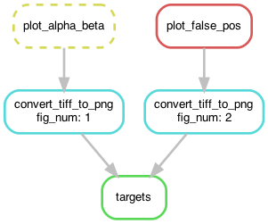

# figure-convert-reprex

A minimal reproducible example for converting a bunch of unique figure names
to the canonical form `figure_{num}` without repetitive code.

## Question

> Snakemake best practice question... I have 10 figures for the paper I am working on. I need to map the name of the figure to "figure_x" and convert from tiffs to pngs to embed into a PDF. Here's what I've got currently...
> 
> ```python
> rule fig_1:
>   input:
>     "figures/alpha_beta_depth_correlation.tiff",
>   output:
>     "submission/figure_1.png",
>   shell:
>     """
>     convert figures/alpha_beta_depth_correlation.tiff submission/figure_1.png
>     """
> 
> rule fig_2:
>   input:
>     "figures/false_positive_null_model.tiff",
>   output:
>     "submission/figure_2.png",
>   shell:
>     """
>     convert figures/false_positive_null_model.tiff submission/figure_2.png
>     """
> 
> rule fig_3:
>   input:
>     "figures/false_positive_null_model_size.tiff",
>   output:
>     "submission/figure_3.png",
>   shell:
>     """
>     convert figures/false_positive_null_model_size.tiff submission/figure_3.png
>     """
> ```
> 
> Of course, this continues for 7 more figures. The downside of this approach is that there are 10 rules that are effectively the same. Alternatively, I could create one rule with 10 inputs, outputs, and lines in shell. The downside of the single rule is that if I want to update figure 3 then it constructs the dag for all of the outputs. Is there a better way that I'm missing?

## Solution




The magic is in defining a dictionary that maps figure numbers to figure names:
```python
figures_dict = {1: 'alpha_beta_depth_correlation', 
                2: 'false_positive_null_model',
                3: 'false_positive_null_model_size'}
```

And using an input function to access the 
input figure name from the output figure number:
```python
rule convert_tiff_to_png:
    input:
        tiff=lambda wildcards: f"figures/{figures_dict[int(wildcards.fig_num)]}.tiff"\
    output:
        png="submission/figure_{fig_num}.png"
    shell:
        """
        convert {input.tiff} {output.png}
        """
```
